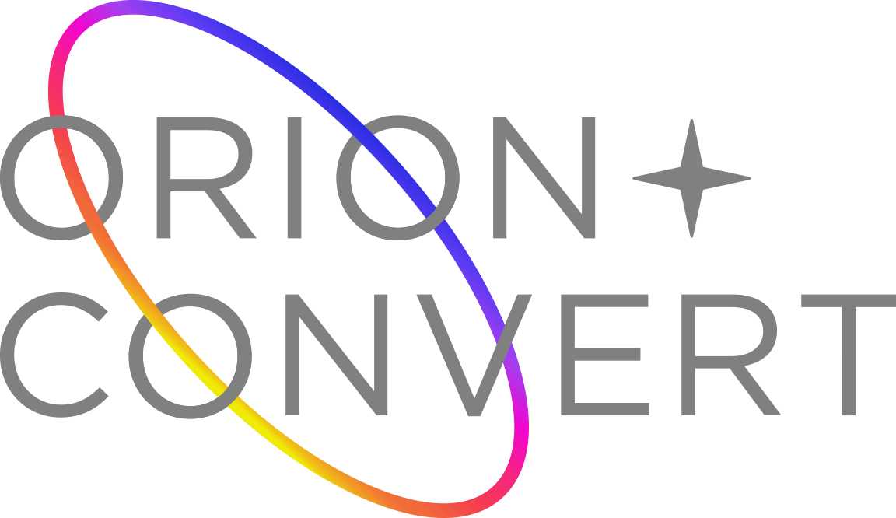

USER MANUAL V2.0  
Revision 1

# Introduction

## The ORION-CONVERT™ algorithm

Conversion between HDR  \<-\>  SDR can be performed either on a 'live' signal, using a hardware signal processor, or in post-production using editing or colour correction (grading) software. This conversion may be done mathematically, using an algorithm that takes the numerical values of each image pixel and calculates new values, based either on preset functions or parameterised controls to modify the conversion. Alternatively, a Look-Up Table (LUT) may be used which is a list of the output colours corresponding to particular input colours. LUTs are an efficient way of processing images but are imprecise because it is not practical to include every possible input colour in the list. A subset is used with in-between colours being created by interpolating (blending) between the nearby colours in the list.  

The ORION-CONVERT™ algorithm takes a novel three-step approach to HDR \<-\> SDR conversion, with a simple and intuitive set of user controls. The intent is not that these controls should be adjusted continuously during a broadcast transmission, or per clip in an edit, but rather that settings suitable for a particular situation will be found and used as 'presets'.  

Other HDR conversion systems based on LUTs offer a range of presets for different scenarios, but this means there are a large number of LUTs and understanding which one is appropriate in a given situation is not easy. There is also no option to 'tweak' the conversion to the needs of a particular production. Other adjustable hardware conversion systems exist, but none have the simplicity and elegance of the ORION-CONVERT™ approach. They require the user to go through multiple pages of menus, making different choices, to set up the conversion.   

Because the ORION-CONVERT™ conversion is mathematically defined, it is mathematically invertible. Applying identical parameter values in HDR to SDR (down-conversion) and then in SDR to HDR (up-conversion) will perform the same process in reverse. The compressed highlights of the SDR signal are expanded and converted to HDR. This can be used either to produce a simulated HDR signal from an SDR camera (such as a specialty slow-mo camera or mini-cam) or to recreate an original HDR signal from a prior down-conversion.   
 
If this process is applied in high precision floating point, the round-trip of a down-conversion followed by an up-conversion can be lossless. A hardware signal processor will always have limited output precision (normally a 10-bit SDI or HDMI signal) so in this case feeding the resulting signal to a second device applying an inverse conversion will not produce a signal identical to the original. Nonetheless, testing has shown that the difference is indistinguishable to a viewer.  

The ORION-CONVERT™ user interface makes it simple to set up two conversions as a matched pair of up and down conversions.  
  
<figure>
  
  <figcaption>The ORION-CONVERT™ User Interface in Ennio</figcaption>
</figure>

# The Interface (CONFIG)

## Lock Controls

The controls can be locked to prevent accidental changing of parameters once selected. 

## Input Compression/Expansion

Either compression or expansion will be available, depending on whether the output format covers more or less dynamic range than the input format.

### Knee

This controls the breakpoint where compression or expansion begins on the selected input signal for the conversion.  The units are in IRE of the input signal.

*Example: In an up-conversion (SDR to HDR), the signal above this level will be boosted to expand the SDR into the HDR domain.*

### Amount

This controls the amount of compression in down-conversion and expansion in up-conversion. 

*When compressing, a value of zero applies no compression (at which point the value of the ***Knee*** is irrelevant) and a value of 1 will compress completely, flattening everything above the value of the ***Knee*** to that value.* 

> *Note: For S-Log3 formats, the IRE values are relative to the full 0-1023 range of the signal, whereas for other formats they are relative to the 64-940 narrow range.*

## Conversion

Here the user can choose the input and output format of the conversion, including choosing between different primaries where appropriate. Matched input and output formats may be selected in order to apply ORION compression, look processing or limiting without conversion.  
    
After selecting settings for a conversion, if the direction of the conversion is reversed, the parameters relating to input and output compression are swapped to generate an absolute mathematical inverse. This way, a visually lossless roundtrip is possible due to the high-precision calculations used by ORION-CONVERT™.

## Mode: Display light and Scene light

Here the mode of conversion can be selected, performing calculations in either scene or display light. For some types of conversion, the mode is fixed, due to the formats being converted. For others, it is user-selectable.
For more details, see [Appendix A](#appendix-a).

## HDR and SDR Reference points

This controls the HDR and SDR 'anchor points'. At the default settings of 75 and 100, for example for an HLG to SDR conversion, if no compression or expansion is applied, 75% HLG will be mapped to exactly 100% SDR (direct mapping). If any compression or expansion is applied, and these values are above the ***Knee*** points, the correspondence will be shifted.

## HDR Peak

This is the peak luminance (referred to as Lw in ITU-R BT.2100) in nits of the 'virtual HLG display' used in conversion calculations. This is normally left at the default value of 1000.

The principal effect of this setting is to control the gamma of the HLG OOTF as defined in ITU-R BT.2100. In PQ conversions this value also controls how much of the 10,000 nit range which can be represented by PQ will be mapped to the destination format. In PQ conversions, when this value is altered, the PQ ***Knee*** and ***Ref*** point will also change to reflect this.

> Note: This value is not used in scene-light conversions.

## Log Offset

When a log format (S-Log3 or LogC3) is selected as the input or output format, an additional ***Log Offset*** control is made available. This controls the exposure relationship in stops between the log signal and other formats. A ***Log Offset*** of zero will map the standard mid grey value for the log format to the equivalent of 38% HLG. Some cameras which offer S-Log3 and HLG output apply an exposure offset between the signals. Our testing indicated that this was about \-0.7 stops for the camera we tested, but you should test your own setup if an exact match is required.

When this value is changed, the ***Ref*** and ***Knee*** value for the log signal will also be modified to reflect this.

## Look

As well as technical conversion, the ORION-CONVERT™ plugin provides creative look controls. Preset looks can be loaded to emulate those provided in certain cameras, and if enabled by your licence, looks can be saved as ***.olook*** files to be shared with other users.

### Look Inverted

Applies all the look changes in reverse, allowing removal of a previously applied look.

### Pedestal

Raises and lowers the black level of the image.

### Contrast

A curve-based contrast adjustment.

### Exposure

Exposure modification in stops.

### Saturation

Saturation control.

## Output Compression/Expansion

Either compression or expansion will be available, depending on whether the output format covers more or less dynamic range than the input format.  
    
### Knee

This slider controls the threshold at which compression (for down-conversion) or expansion (for up-conversion) begins. This is in IRE units of the output signal.

*Example: A value of 50 places this at 50% SDR IRE in a down-conversion. The start of the compression will be seen at this value on a waveform monitor because this compression is the last step of the process.*

### Amount

This controls the amount of compression in down-conversion and expansion in up-conversion. When compressing, a value of zero applies no compression (at which point the value of the ***Knee*** is irrelevant) and a value of 1 will compress completely, flattening everything above the value of the ***Knee*** to that value. 

> *Note: For S-Log3 formats, the IRE values are relative to the full 0-1023 range of the signal, whereas for other formats they are relative to the 64-940 narrow range.*

## Gamma Compensation

This switch will enable conversion using the optional gamma adjustment, described in ITU-R BT.2446-1 section 5.1.2, to create a closer perceptual match to the HDR when viewing converted SDR at 100 nits. Without the use of this compensation, some users choose to set their SDR monitors to 200 nits.  
    
A custom shadow compression curve is included, to compensate for the lifted blacks that the ITU-suggested formula for this method can produce.

## Clamping

Internally the result of the conversion is unclamped float, meaning that even HDR values that cannot be represented on an SDR display after conversion, will be converted to SDR values outside the displayable range. When outputting over SDI, it is necessary to limit the range of the output. This control applies a clamp to the output R'G'B' values.

Options:

- Unclamped (clamping will still occur in hardware output)          
- Clip sub-blacks  
- \-7 to 109 IRE (SDI permissible range)  
-  \-5 to 105 IRE (EBU R 103 preferred range)  
- 0 to 100 IRE  

## P3 Limit

Most consumer HDR TVs on the market at this time are only capable of displaying up to the P3-D65 colour gamut. It is a common practice in the post-production of HDR-graded content, to limit the image to P3-D65 so that what is seen on the master reference monitor matches what the consumer is able to see.

A limiter is included for those that want to use ORION-CONVERT™ as an HDR to HDR mastering conversion tool. This limiter will still retain the primaries of the BT.2020 container, but constrain colours to within the P3-D65 gamut.

<figure>
   
    <alt="TThe Effect of P3 Output Limiting">
  <figcaption>The Effect of P3 Output Limiting</figcaption>
</figure>  
  
The ORION-CONVERT™ P3 limiter uses an advanced luminance-preserving approach.

P3 limiting is only available for conversions whose output is a display-referred HDR format (PQ or HLG) and will be applied after the conversion. 

## Conversion Setup

Thanks to the core design of the ORION-CONVERT™ algorithm, it is very easy and fast to create a conversion roundtrip (up-conversion and down-conversion) in just one go.

To do this, choose one of the conversions needed (we recommend starting with an HDR to SDR for example) and feed content into the device.

Choose on the drop-down menus the direction of the conversion and select the method you would like to use and all other parameters relevant to your conversion (HDR Peak, etc...).

Now you are all set to start creating your highlight compression/expansion using the powerful input and output sliders.

Once you’ve found the desired result, simply invert the direction of the conversion on the drop-down menus and you will get an absolute mathematical inverse to ensure a clean roundtrip.

To understand how the various ORION-CONVERT™ controls operate, it can be useful to view the result on a waveform monitor of passing a linear ramp test pattern through the conversion, while adjusting the controls. This will give the user a more intuitive feel for their effect.

Graphics are normally\* converted without any highlight compression or expansion which is often referred to as 'direct mapping'.

\* some creative approaches to graphic content creation can be used to enhance or allow for a more 'HDR look' after conversion, such as using slightly lower RGB values for graphic text to leave room for specular highlights in the graphics. These can then be expanded once the graphics are converted.

## HDR Mastering Setup

When using ORION-CONVERT™ as an HDR mastering tool, a no-conversion (HLG to HLG or PQ to PQ) transform can be selected in the conversion drop-down menus.  
    
By using the ***Input Compression*** controls, the user can roll off any highlights beyond the range that a target consumer TV will be able to display; for example, super white areas  (109% IRE) in HLG or different peak brightnesses when in PQ (2000 nit to 1000 nit, etc.) and adjust the signal to the delivery range desired.  
    
In this mode, a P3 limiter may be applied, if required by the delivery spec, for example.  

# Appendix A

There’s a great deal of confusion about the use of the two types of conversion described in BT.2390. It is perhaps useful to start with some definitions.

## Scene-referred

A scene-referred encoding is one where there is a defined mathematical relationship to the original scene light. Camera log encodings, such as S-Log3 and LogC3 are scene-referred (strictly relative scene-referred, since without knowledge of the camera’s exposure setting the absolute scene luminance cannot be inferred).

## Display-referred

A display referred encoding is one where there is a defined mathematical relationship to the light produced by a display. PQ is an absolute display-referred encoding, as a given PQ code value specifies the exact luminance produced by a reference display. BT.1886 is relative display-referred, since the luminance produced is relative to the peak luminance of the display.

## Conversions

A conversion to or from PQ can only ever be performed in display light, since it is a representation in a different format of the absolute luminance produced by the PQ signal.
A conversion to or from a camera log format can only ever be performed in scene light, since these formats do not define the display light produced.

The complication arises with HLG which is in some senses both scene and display-referred. If an HLG camera produces a signal which is exactly as specified in BT.2100, the scene luminance (relative to diffuse white) can be inferred from that signal. In reality, shading and other camera adjustments mean the signal diverges in an unknown way from the pure standard for creative and technical reasons, so scene luminance cannot be inferred. Many argue that HLG is in fact display referred, since BT.2100 describes the relationship between the HLG signal and a 1000 nit reference display, and a reference display should not diverge from the standard.

SDR too has a relationship to scene light defined in Rec.709, and a relationship to display light defined in BT.1886. Again, camera adjustments will break the scene light relationship.

A display light conversion between HLG and SDR aims to match the appearance of the image on the HDR and SDR displays. If gamma compensation is not applied, the luminance ratios on the two displays are identical below the roll-off knee points. Gamma compensation diverges slightly from this with the aim of improving the perceptual match at a different absolute luminance, but the aim is still matching of the two displays.

A scene light conversion between HLG and SDR aims to produce a match between the signals which would have been produced by an HLG and SDR camera pointed at the same scene. These will however not appear exactly the same on HDR and SDR displays. This is because of the different methods used for mapping signal to display in BT.1886 and BT.2100 HLG. The result of this is that shaders viewing an HLG signal or an SDR signal produced using a scene-light conversion might make slightly different choices, particular in regard to saturation.

## Which mode to choose?

A number of factors will influence the choice of scene or display light mode (when available) and there is no one correct choice for every scenario.

When up-converting graphics created in SDR (often sRGB) to HLG for inclusion in an HDR transmission, a display light conversion is normally the most appropriate, in order to maintain the appearance of the graphics as they were seen on screen when created.

Likewise when down-converting an HLG signal for SDR transmission, a display light conversion will create the best appearance match between the HDR and SDR streams.

Cameras which are able to simultaneously produce SDR and HDR output often use scene light conversion[^1] (in part due to historical limitations in camera processing capabilities). If it is necessary to externally match an in-camera conversion, a scene light conversion is usually more appropriate.

When converting a feed from an SDR only camera for inclusion in an HDR programme, a scene light conversion may be more appropriate, although the choice may be influenced by any processing in the SDR camera which alters the signal from being purely scene-referred.

At the end of the day, thorough testing of the complete setup, including all the different sources and outputs is the only way to ascertain the most appropriate choices.

[^1]: Some cameras may include separate processing in the HDR and SDR pathways which can alter the scene light relationship.

  

Copyright ORION-CONVERT™  
Version 2.0 September 2024  

